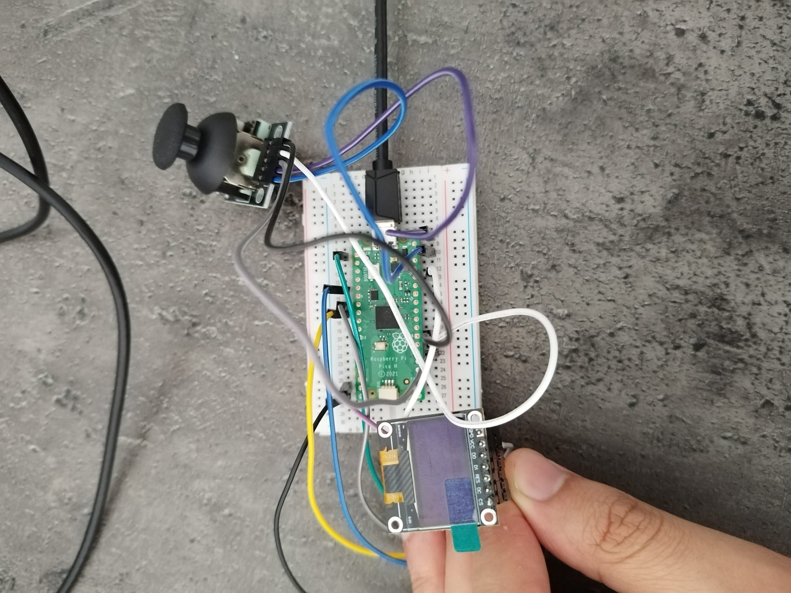

# Snake Game
Snake game where players control the snake's movement using a joystick

:::info 

**Author**: Güneri Alişan \
**GitHub Project Link**: https://github.com/UPB-FILS-MA/project-Guneri37

:::

## Description

In the game, players control a snake that moves around a grid. The snake continuously slithers in the direction it's moving, and the player's goal is to guide the snake to eat food that appears on the grid. Each time the snake eats food, it grows longer, making the game more challenging as the snake becomes harder to maneuver.

## How it works

1.Hardware Setup
   - You have a Raspberry Pi connected to a joystick and an SSD1306 display.
   - The joystick provides directional input, allowing players to control the movement of the snake.
   - The SSD1306 display is used to render the game grid, snake, food, and other elements.

2.Game Logic:
   - The game is implemented in Rust.
   - It maintains a representation of the game state, including the positions of the snake, food, and any obstacles (such as walls).
   - The snake continuously moves in a specific direction until directed otherwise by the player's input.
   - When the snake eats food, it grows longer, increasing the game's difficulty.
   - Collision detection is performed to determine if the snake collides with walls, itself, or food.

3.Input Handling:
   - Input from the joystick is read using GPIO pins on the Raspberry Pi.
   - Movement of the joystick is translated into directional input for the snake (up, down, left, right).
   - This input is used to update the direction of the snake in the game state.

4.Display Rendering:
   - The game state, including the positions of the snake, food, and grid, is rendered onto the SSD1306 display.
   - Graphics primitives (such as lines and shapes) are used to draw the grid, snake segments, and food on the display.
   - The display is continuously updated to reflect changes in the game state, providing real-time feedback to the player.

5.Game Loop:
   - The game runs in a loop, continuously updating the game state, handling input, and rendering the display.
   - The loop maintains a consistent frame rate to provide smooth gameplay.
   - As the game progresses, the snake's movements and interactions with food and obstacles are updated, and the display is refreshed accordingly.

6.End Game Conditions:
   - The game ends when the snake collides with a wall or itself.
   - When the game ends, the final score (based on the length of the snake) may be displayed on the SSD1306 display.

## Motivation

My motivation for making this game likely combines elements of personal interest, learning and skill development, creativity, practical application, and problem-solving. It's a project that allows you to explore your passions, enhance your abilities, and create something meaningful and enjoyable.

## Architecture 


## Log

<!-- write every week your progress here -->

### Week 6 - 12 May
I choose the concept and the main ideas for this project.

### Week 7 - 19 May
I found all the hardware parts and everything that i need and i proceed a order.

### Week 20 - 26 May
I am still at the hardware part, at all the connection and everything. I try to make them work

## Hardware

The hardware I am using  Raspberry Pi using a joystick for control and an SSD1306 display for rendering the game.

### Schematics




### Bill of Materials

<!-- Fill out this table with all the hardware components that you might need.

The format is 
```
| [Device](link://to/device) | This is used ... | [price](link://to/store) |

```

-->

| Device | Usage | Price |
|--------|--------|-------|
| [Rapspberry Pi Pico W](https://www.raspberrypi.com/documentation/microcontrollers/raspberry-pi-pico.html) | The microcontroller | [35 RON](https://www.optimusdigital.ro/en/raspberry-pi-boards/12394-raspberry-pi-pico-w.html) |
| [Joystick Breakout Board](https://www.optimusdigital.ro/en/touch-sensors/742-ps2-joystick-breakout.html) | The Controler | [5,35 RON](https://www.optimusdigital.ro/en/) |
| [SSD1306 OLED Display](https://www.optimusdigital.ro/en/lcds/194-yellow-and-blue-096-oled-module-128x64-px.html) | The Display | [23,79 RON](https://www.optimusdigital.ro/en/) |
| [Breadboard](https://www.optimusdigital.ro/en/breadboards/8-breadboard-hq-830-points.html) | The Breadbord | [9,98 RON](https://www.optimusdigital.ro/en/) |
| [Jumper Wires](https://www.optimusdigital.ro/en/wires-with-connectors/12-breadboard-jumper-wire-set.html) | [7,99 RON](https://www.optimusdigital.ro/en/) |
| [Male-Female Wires](https://www.optimusdigital.ro/en/wires-with-connectors/879-30-cm-male-female-wires-10p.html) | [5,79 RON](https://www.optimusdigital.ro/en/) |
## Software

| Library | Description | Usage |
|---------|-------------|-------|
|[embassy](https://github.com/embassy-rs/embassy) | Rust framework for embedded programming |  Used for writing correct, safe and asynchronous code, particularly targeted at embedded systems |
| TBD | TBD | TBD |

## Links

<!-- Add a few links that inspired you and that you think you will use for your project -->

1. [lab 0](https://embedded-rust-101.wyliodrin.com/docs/lab/00)
2. [lab 2](https://embedded-rust-101.wyliodrin.com/docs/lab/02)
...
